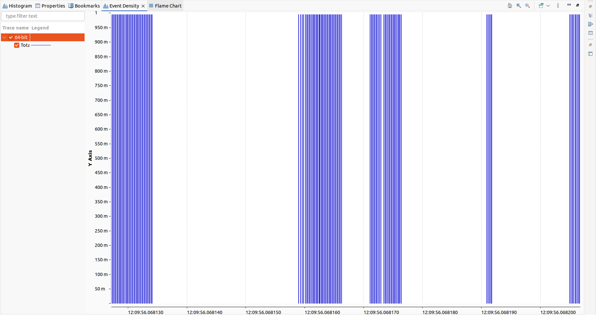
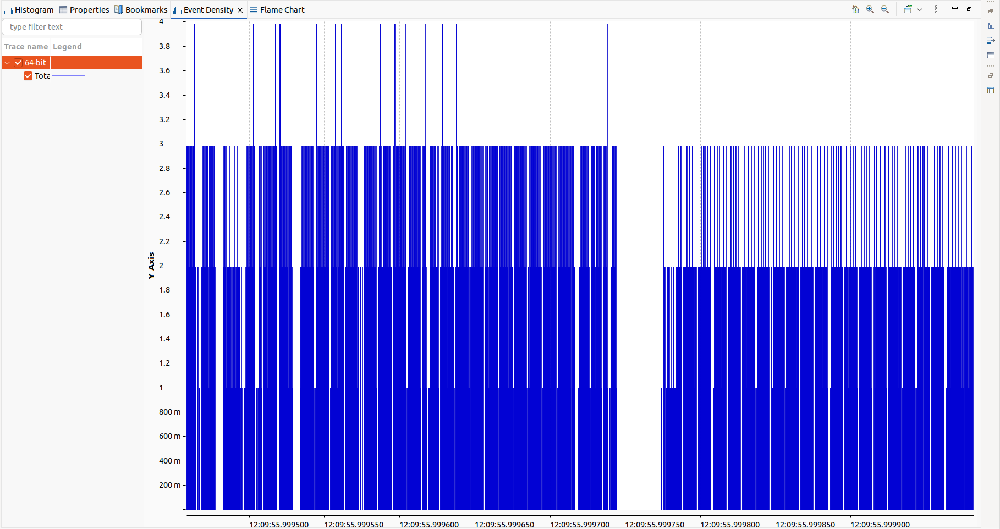
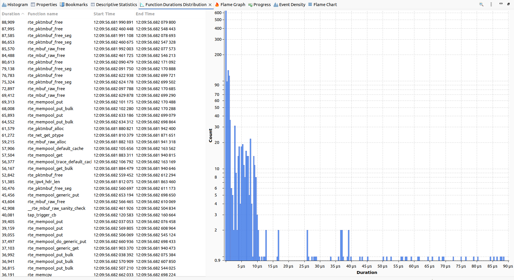
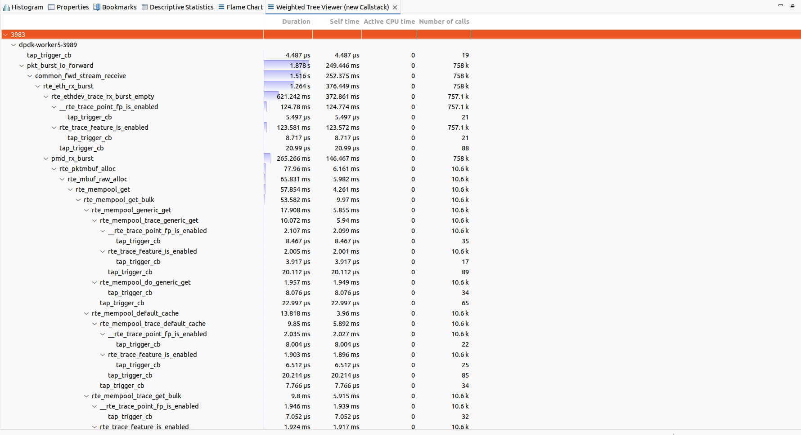
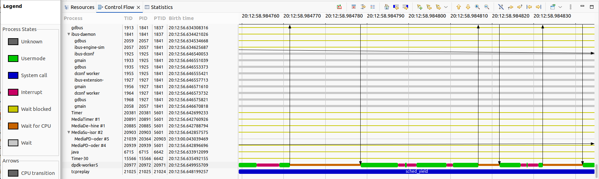
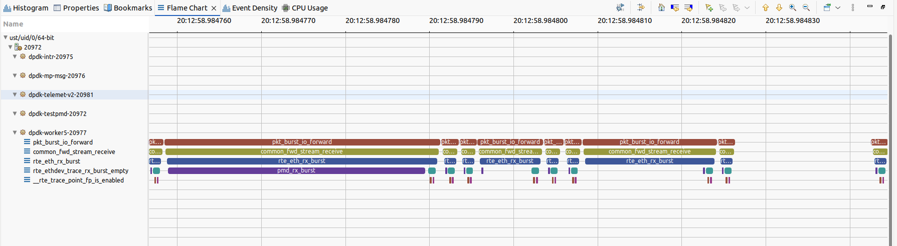

# Dpdk-TAP-Driver

This repository contains dpdk TAP driver and test-pmd application analysis with lttng tool and trace compass gui.

## System Specifications

The project was executed on the following system:

```bash
Architecture: x86_64
CPU op-mode(s): 32-bit, 64-bit
Byte Order: Little Endian
Address sizes: 39 bits physical, 48 bits virtual
CPU(s): 8
On-line CPU(s) list: 0-7
Thread(s) per core: 2
Core(s) per socket: 4
Socket(s): 1
NUMA node(s): 1
Vendor ID: GenuineIntel
Model name: Intel(R) Core(TM) i7-1065G7 CPU @ 1.30GHz
CPU min MHz: 400.000
CPU max MHz: 3900.0000
...
```
# Tracing Analysis - UDP Filtering

## Event Density Drops

It is obvious event density drops to zero when context switch happens for lcore 5 without regrads to the function that is being called, it should wait for another switch to load dpdk-worker5 application variables.

> ▸ _As specified OS uses CFS (Completely Fair Scheduling) that works based on priority scheduling, it is more probable for some threads that are being ran with lower priority will experince more context switches (the reason of high standard deviation for several functions or huge self time/duration in flame graph) for instance: `rte_net_get_ptype`, `pmd_rx_burst`, `pmd_tx_burst`_

---



<br>

## PMD Rx vs Tx burst

pmd_rx_bursts contains more events against pmd_tx_bursts while their call stack is vice versa.

> ▸ _Consecutive pmd_rx_bursts can cause density increase like a sigmoid function._

---



<br>

## Function Duration Distribution

The main distribution is between **140 ns** to **10 us**.

> ▸ _There are only 7 function that lasted longer than 100 us and the longest should belong to a layer zero function as expected: `pkt_burst_io_forward`_

---



<br>

## Hot Code Paths

| Function                        | ratio | Responsibility                           |
|---------------------------------|-------|------------------------------------------|
| rte_net_get_ptype               | 51.7% | Determine packet type by parsing headers |
| rte_ethdev_trace_rx_burst_empty | 60.0% | Trace an empty RX burst (0 packets)      |
| pmd_rx_burst                    | 55.2% | Poll RX queue and fetch received packets |

> ▸ _These paths can be found via functions with two layers upper towards `tap_trigger_cb` (can be called at last layer of call stack because of its event driven nature) that have bigger ratio of self time over duration than others._

---



<br>

## Practical mitigation options

| Mitigation                     | Applicable Context        | Implementation                                     |
|--------------------------------|---------------------------|----------------------------------------------------|
| Process priority surge         | networking environments   | nice() or setpriority() to change process priority |
| CPU core isolation             | deterministic performance | At boot time, isolate core via kernel parameters   |
| Pre-slice traffic in generator | Synthetic workload        | Send UDP frames to a dedicated TAP.                |

> ▸ _The fourth core is dedicated for running app and 5 to 7 are in charge of forwarding packets, but only core 5 was used.This can be increased as described in [Intel Manual](https://www.bing.com/ck/a?!&&p=133bafcb2e934382baeacdda3640a23fc7aff520198bc1d12ebcd43320968603JmltdHM9MTc1MzkyMDAwMA&ptn=3&ver=2&hsh=4&fclid=1272d906-47db-60ab-2561-cd0446d26150&psq=dpdk+bad+througput&u=a1aHR0cHM6Ly93d3cuaW50ZWwuY29tL2NvbnRlbnQvZGFtL2RldmVsb3AvZXh0ZXJuYWwvdXMvZW4vZG9jdW1lbnRzL3Rlc3RpbmctZHBkay1wZXJmb3JtYW5jZS1hbmQtZmVhdHVyZXMtd2l0aC10ZXN0cG1kLTcyMTA5MC5wZGY&ntb=1)._

---

<br>

## Control Flow

Another trace was done with both kernel and userspace involved to prove the idea that was discussed earlier.

> ▸ _interrupt and followed context switches of core 5 causes delay in dpdk-worker5 functions and causes the thread to wait for CPU cycles._

---



<br>

## Flame Chart

The relative chart that shows why stalls occur.

> ▸ _Both interrupt and wait for CPU will cause delay._




<br>

## Challenges and Solutions

### 1. Missing Meson Module

* **Issue**: Encountering No module named 'mesonbuild.machinefile' in running `meson install` after `ninja` command.
* **Solution**: uninstall all meson versions that are installed with pip or apt and their relative libraries in usr/ folder, then install it with root priviledges (not as a superuser) by pip.

  ```bash
  sudo pip install meson
  ```
* **Outcome**: meson successfully installs the compiled artifacts.

### 2. Empty Trace Folder

* **Issue**: After running lttng script, the ust folder of trace is empty.
* **Solution**: Clean install lttng stable ppa version with [LTTng Stable 2.13 PPA installation Guide](https://lttng.org/docs/v2.13/#doc-ubuntu-ppa) 
* **Outcome**: Trace has captured preloaded fuctions.

### 3. Null Trace Compass Views

* **Issue**: Call stack views ( Flame Graph & Flame Graph Selection) are empty.
* **Solution**: install java-21 and set as deafult version of java.

  ```bash
  sudo apt install openjdk-21-jdk -y
  ```
* **Outcome**: Call stack gets visible (still needs sometime based on your Ram and CPU).

### 4. Missing Function Names

* **Issue**: some functions are available only by their address not their names.
* **Solution**: shut down tcpreplay and testpmd before stopping and destroying lttng.
* **Outcome**: Function entries and exits get equal, then you may see the all the function names.
